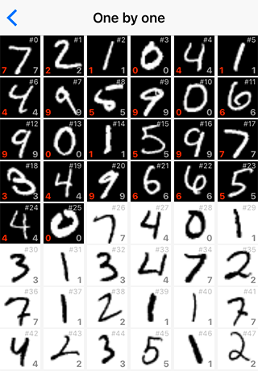

# Demo MNIST on iOS BNNS

Importing deep convolutional network from [TensorFlow: Deep MNIST for Experts][TF-TUT] to iOS 10 BNNS

Read here: https://paiv.github.io/blog/2016/09/25/tensorflow-to-bnns.html

  

[TF-TUT]: https://www.tensorflow.org/versions/master/tutorials/mnist/pros/index.html
